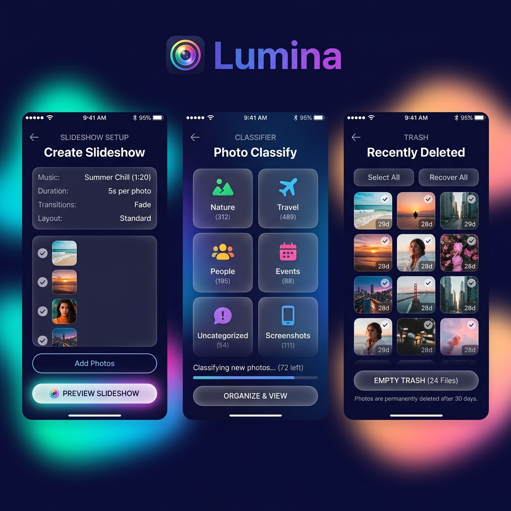

# Lumina UI Design Történet

Ez a dokumentum rögzíti a Lumina projekt arculatának fejlődését.

---

## [v1.3 - AZ IGAZI] - 2026-05-02

Ez a véglegesített arculat, amely az eredeti v1.0 minden látványos elemét (színes háttérfények, üveghatás) megtartja, de a brandinget szinkronizálja.

### Főbb Jellemzők:
*   **Design Alap**: Az eredeti v1.0-ás "Vibráló Glassmorphism" stílus (látványos háttérglow, modern panelek).
*   **Branding Szinkron**: A "Lumina" felirat színe szigorúan az eredeti **Indigó-Lila** (Indigo-500 -> Purple-600) gradiens.
*   **Ikonográfia**: Színes, Lucide-alapú ikonok.
*   **Hangulat**: Prémium, élettel teli és modern.

### Látványterv:

---
*Várom a további javaslatokat...*
